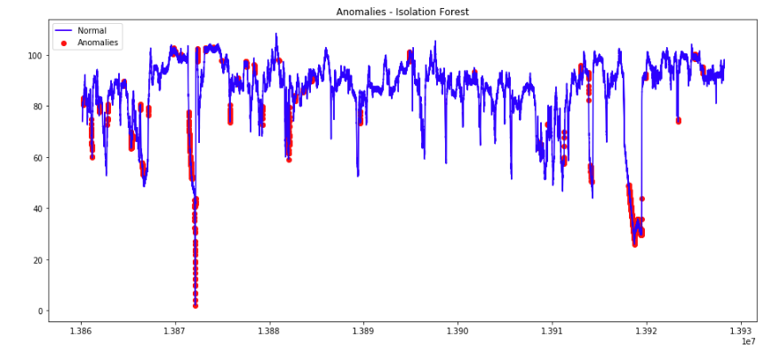

D(St)ream of Anomalies
==============================

Anomaly Detection Project

## Introduction:
The project is about trying to detect anomalies in a dataset using other features as columns. 

The data was obatined from the following link:

https://github.com/numenta/NAB/tree/master/data

The data is aboutambient_temperature_system_failure.csv: The ambient temperature in an office.

## Approach:

### Feature Engineering
* Our timestamp column contains extra information we are going to try to utilize this extra information by using it to create new columns.

* The columns we are going to create are Hours, Daylight, DayOfTheWeek and WeekDay and Month.

* I checked univariate and multivariate anomaly detection techniques.

* The multivariate approahes i used were: Isolation Forest and the One Class SVM.

* I also implemented local outlier factor.

### 1. Univariate Isolation Forest
Univariate outliers can be found when looking at a distribution of values in a single feature space. Isolation Forest was considered for doing univariate anomaly detection with the temperature used as the single feature.
When using Isolation forest with just the temperatue values this is what we get:

#### According to the above figure temperatures above 100 are outliers and temperatures below 60 are also outliers.

Multivariate outliers can be found in a n-dimensional space (of n-features).  The multivariate approahes i used were: Isolation Forest and the One Class SVM.

### 2. Isolation Forest
The main idea is that Isolation Forest explicitly identifies anomalies instead of profiling normal data points. Isolation Forest is built on the basis of decision trees. In these trees, partitions are created by first randomly selecting a feature and then selecting a random split value between the minimum and maximum value of the selected feature.
In principle, outliers are less frequent than regular observations and are different from them in terms of values (they lie further away from the regular observations in the feature space). That is why by using such random partitioning they should be identified closer to the root of the tree (shorter average path length), with fewer splits necessary.

### 3. One Class SVM
A One-Class Support Vector Machine is an unsupervised learning algorithm that is trained only on the ‘normal’ data. It learns the boundaries of these points and is therefore able to classify any point that lie outside the boundary as outliers.
One Class SVM is best suited for novelty detection when the training set is not contaminated by outliers. That said, outlier detection in high-dimension, or without any assumptions on the distribution of the inlying data is very challenging, and a One-class SVM might give useful results in these situations depending on the value of its parameters.

### 4. Local Outlier Factor
It is an unsupervised outlier detection technique which computes the local density deviation of a given data point with respect to its neighbors. It considers as outliers the samples that have a substantially lower density than their neighbors. LOF is used for outlier detection it has no predict, decision_function and score_samples methods.

#### Local Outlier Factor (LOF) is a score that tells how likely a certain data point is an outlier/anomaly.
* LOF ≈ 1 ⇒ no outlier
* LOF ≫1 ⇒ outlier

## Discussion and Conclusion:
Some univariate anomaly detection techniques were explored.

Univariate Isolation Forest was implemented.

When using Univariate Isolation Forest temperatures above 100 are outliers and temperatures below 60 are also outliers.

Two multivariate anomaly detection algorithms were implemented: The first approach is the Isolation Forest and the other approach is the One Class SVM.

Using the Isolation Foreset we were able to detect 1133 anomalies out of 22695 records which is about 5%.

Using One Class SVM we were able to detect 1078 anomalies out of 22695 records which is about 4.7%.

The Local Outlier Factor algorithm was used to try to detect anomaly points.

#### Summareis of results: 
##### Isolation Forest: 1135 anomalies detected out of 22695 records
##### One ClassSVM: 1080 anomalies detected out of 22695 records

* We observe that both algorithms were able to detect roughly equal number of anomalies.

